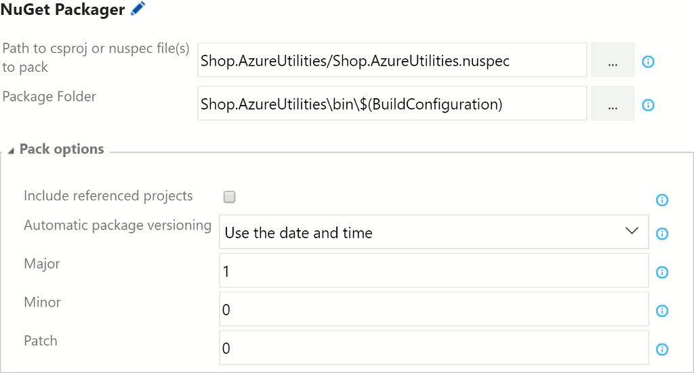
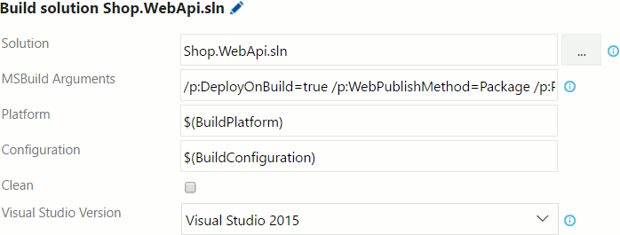
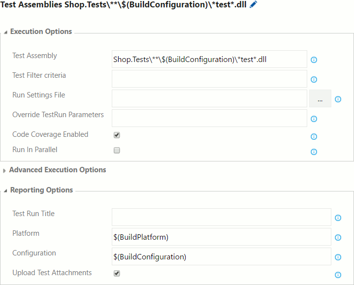
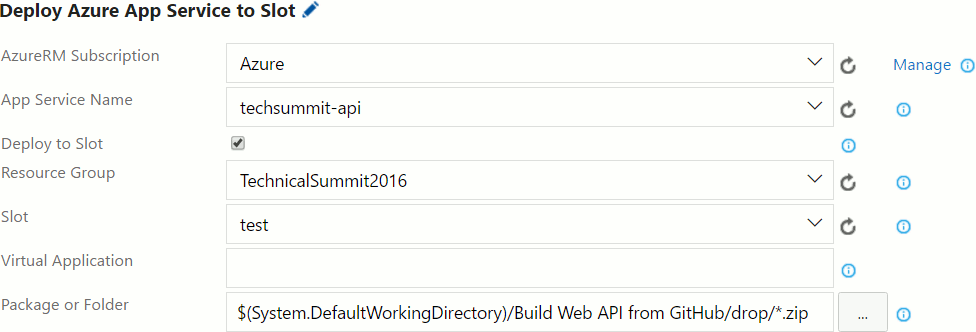

# Microsoft Technical Summit 2016 - Sample

## Introduction

At Microsoft Germany's [Technical Summit 2016](https://www.microsoft.com/germany/technical-summit/agenda.aspx), I do a session about using the cloud in web development project. This repository contains the sample code I use during the session.

The sample contains a [RESTful web API](Shop.WebApi) implemented with [OWIN/Katana](https://www.asp.net/aspnet/overview/owin-and-katana) in .NET 4.6.1. I could have used [.NET Core](https://www.microsoft.com/net/core) for the web API, too. However, Visual Studio and VSTS tooling is not final and polished yet. The extra steps necessary for a .NET Core version would lead to exceeding the amount of time I have for my session. For the general message of the session, it does not matter whether I use OWIN or ASP.NET Core. Therefore, I decided to use the "old" .NET version.

The RESTful web API uses a [library with Azure-related helper functions](Shop.AzureUtilities). I create a NuGet package containing the library. The web API project references this package. 

Next, I created [automated tests for the server code](Shop.Tests). They use OWIN self-hosting and MEF for dependency injection to test the web API. To not just demo unit testing, I additionally added a simple [web and load test](Shop.WebApiLoadTest).

Last but not least, this sample contains a simple [Angular 2 web client](Shop.Client). It calls the web API and displays its result.

## Step 1: Feeds

Web development teams need to share components. In .NET we use NuGet for that, in web client development NPM. [VSTS can offer NuGet and NPM feeds](https://www.visualstudio.com/en-us/docs/package/overview) that teams can use. It is no longer necessary to manually setup and configure your own NuGet or NPM servers.

* Code walkthrough of [Shop.AzureUtilities](Shop.AzureUtilities)
* Show prepared build process in VSTS
  * Show connection to GitHub
* Add NuGet creation step to build process (speak about versioning)

* Create a new feed in VSTS (use it as an example for speaking about NuGet and NPM feed support in VSTS)
* Create [release management](https://www.visualstudio.com/team-services/release-management/) for publishing the created NuGet package into the new feed

* Create release and show how NuGet package is published in VSTS
* Open [web API project](Shop.WebApi) and add package from VSTS feed
* Show how new feed is referenced in [nuget.config](Shop.WebApi/nuget.config)

## Step 2: Handling Secrets

Nearly every web application needs to handle secrets. Examples are certificates, encryption keys, connection strings, etc. [Azure Key Vault](https://azure.microsoft.com/en-us/services/key-vault/) is a great place to securely store such secrets and if necessary encrypt/decrypt data.

* Show data store of our sample (Azure Table Storage) and speak about [Shared Access Signatures](https://docs.microsoft.com/en-us/azure/storage/storage-dotnet-shared-access-signature-part-1) (=secret)
* Show how secret is added to Key Vault in Azure Portal
* Code walkthrough of [SecretsManager.cs](Shop.WebApi/DataAccess/SecretsManager.cs) and[ActiveDirectoryAccessTokenHelper.cs](Shop.AzureUtilities/ActiveDirectoryAccessTokenHelper.cs)

## Step 3: .NET Build and Test Automation

VSTS contains a powerful build system for .NET applications. It also offers [hosted build agents for CI](https://www.visualstudio.com/team-services/continuous-integration/). It is not longer necessary to manually install TFS or setup build agents.

* Code walkthrough of [Shop.WebApi](Shop.WebApi)
  * Point out tests in [Shop.Tests](Shop.Tests)
* Create new build process for web API project
  * Add MSBuild arguments triggering creation of web deploy package: `/p:DeployOnBuild=true /p:WebPublishMethod=Package /p:PackageAsSingleFile=true /p:SkipInvalidConfigurations=true /p:PackageLocation="$(build.stagingDirectory)"`

  * Speak about general capabilities of VSTS build in this context
  * Mention examples (e.g. SauceLabs, Xamarin Test Cloud) for using cloud services for testing clients on different devices and platforms
* Trigger build by checking in code

## Step 4: Deployment Automation to Azure App Service

[Azure App Service](https://azure.microsoft.com/en-us/services/app-service/) is a great PaaS offering for running web apps and web APIs. It is fully managed. VSTS [release management](https://www.visualstudio.com/team-services/release-management/) is nicely integrated with Azure App Service. No need to setup and maintain custom web servers or deploy software manually.  

* Quick overview Azure App Service (prepared)
  * Mention settings
  * Mention deployment slots (especially the `test` slot used in this sample)
* Create release management for publishing the created web deploy package to Azure App Service

* Create release and show how web deploy package is published to Azure

## Step 5: Monitoring

Learning from production is an important aspect of DevOps. Therefore, we need to add logging and monitoring to our solution. [Application Insights](https://azure.microsoft.com/en-us/services/application-insights/) is a great platform for that. All we need to do is add some NuGet packages and a configuration file and we are ready to go. No need for setting up and maintaining your own data store and analysis solution for monitoring and logging.

* Show Application Insights in Azure Portal (prepared)
* Code walkthrough of [ApplicationInsights.config](Shop.WebApi/ApplicationInsights.config)
* Code walkthrough of [ApplicationInsightsExceptionLogger.cs](Shop.AzureUtilities/ApplicationInsightsExceptionLogger.cs)
* Code walkthrough of [OrderTable.cs](Shop.WebApi/DataAccess/OrderTable.cs)
* Run web API in Visual Studio debugger and show Application Insights in VS while calling the [Products API](Shop.WebApi/Controllers/ProductsController.cs)
  * Show Code Lense integration
  * Show dependency tracking
  * Show exception tracking ([Order API with Product ID `4711`](Shop.WebApi/Controllers/OrdersController.cs)) 

## Step 6: Load testing

It is important to make sure that your web solution can handle the expected load. VSTS contains a [load testing feature](https://www.visualstudio.com/de/team-services/cloud-load-testing/). No need to setup load generating agents manually.

* Code walkthrough of [QueryProductsAndAddOrder.webtest](Shop.WebApiLoadTest/QueryProductsAndAddOrder.webtest) and [load test](Shop.WebApiLoadTest/LoadTest1.loadtest)
* Run web test manually
* Run load test in VSTS
* Show Application Insights live stream in Azure Portal while running load test

## Step 7: Build Automation for Web Client

Modern web application often consist of a backend and a SPA front-end. Font end developers don't using MSBuild. They use tools like Grunt, Gulp, or Webpack. Our solution contains a simple [Angular 2 web client](Shop.Client) that is built using [Webpack](https://webpack.github.io/). VSTS can handle that. It can even build and publish [Docker](https://www.docker.com/) images for the web client.

* Code walkthrough of scripts and dependencies in [package.json](Shop.Client/package.json)
* Show how to build Angular 2 client locally using `npm run build-prod`
* Quick overview about Docker (keep it short!)
  * Mention ready-made images in Docker Hub (e.g. `nginx`, `microsoft/dotnet`)
* Code walkthrough of the [Dockerfile](Shop.Client/Dockerfile)
* Create new build process for web client project
  * `npm install`
  * `npm run build-prod`
  * `docker build -t rstropek/techsummitdemoclient ...`
  * `docker push rstropek/techsummitdemoclient`

* Run build process and show how Docker image is built and published to Docker Hub
* Show how `microsoft/vsts-agent` can be used to run configurable, Linux-based VSTS build agents without having to install them manually
  * Demo it by stoping and restarting it: `docker run -e VSTS_ACCOUNT=... -e VSTS_TOKEN=... -v /var/run/docker.sock:/var/run/docker.sock -it rstropek/vsts-agent-node`

## Step 8: Docker Hub Integration in Azure App services

If you use Docker-based images in your web solution, you have to run it somewhere. Of course you could setup your own, custom Docker cluster. With [Linux-based Azure App Services](https://azure.microsoft.com/en-us/blog/app-service-on-linux-now-supports-containers-and-asp-net-core/) you don't need to anymore.

* Create new Linux-based web app in Linux-based App Service plan (prepared)
* Link it with `rstropek/techsummitdemoclient` image in Docker Hub
* Launch web client running in Docker in Azure App Service

